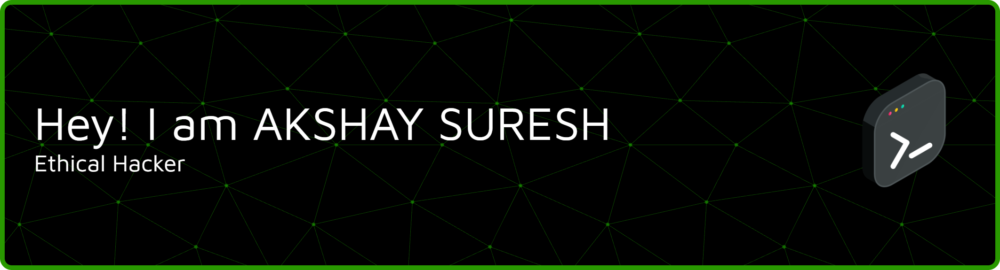

###  RedTeamer | Penetration Tester | Ethical Hacking | Network Security | Python & Linux

- 🎓 Google Cybersecurity Certified  
- 🔐 Passionate about Ethical Hacking & Vulnerability Assessment  
- 👨‍💻 Projects: Phishing Detection System, Port Scanner, VAPT Labs  
- 🌐 Portfolio: https://akshay-devportfolio.vercel.app/  
- 📫 How to reach me: akshaysuresh441@gmail.com  

---

## 🛡️ Cybersecurity Tools & Skills

**Tools:**
- Kali Linux  
- Nmap  
- Wireshark  
- Burp Suite  
- Metasploit  
- SQLmap  

**Concepts:**
- Penetration Testing  
- Web Application Security (OWASP Top 10)  
- Network Security  
- Vulnerability Assessment  
- SIEM & Log Analysis  

---

## 🌐 Connect with me

---

## 💻 Development Skills

